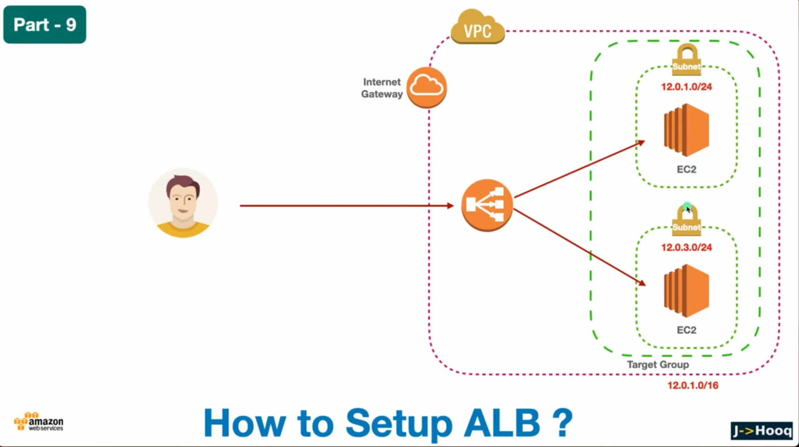

# Optimizing-Traffic-Distribution-with-AWS-Services
This project demonstrates the setup of an AWS Application Load Balancer (ALB) to distribute traffic across multiple EC2 instances for improved scalability and high availability. It ensures fault tolerance and optimal performance by automatically routing traffic to healthy instances.

# Project Explanation and Objective
The project aims to set up an Application Load Balancer (ALB) in Amazon Web Services (AWS) to distribute incoming traffic efficiently across multiple EC2 instances. By using ALB, we ensure high availability, scalability, and fault tolerance for web applications. This setup leverages AWS infrastructure components like VPC, Internet Gateway, EC2, and Target Groups to create a reliable and scalable web hosting environment.

# Project Overview
This project demonstrates how to deploy a robust and scalable web application using AWS Application Load Balancer (ALB). The architecture includes:
VPC: A virtual network in AWS where all resources are isolated.
Internet Gateway: Enables internet access for resources within the VPC.
EC2 Instances: Virtual machines running the web application.
Target Group: Grouping of EC2 instances that ALB routes traffic to.
Application Load Balancer (ALB): Distributes traffic across EC2 instances to ensure scalability and availability.
The goal is to create an architecture where traffic is automatically balanced between multiple instances, ensuring the application can scale based on demand and handle failure scenarios efficiently.

# Key Components and Features
VPC: A logically isolated network to deploy resources securely.
Internet Gateway: Provides internet access to instances within the VPC.
Public Subnet: A subnet that allows communication with the internet.
EC2 Instances: Virtual servers running the application code.
Target Group: A collection of EC2 instances that the ALB routes traffic to.
Application Load Balancer (ALB): Routes and balances traffic between EC2 instances based on defined rules.
Route Table: Configures how traffic flows within the VPC and ensures correct routing of requests.
Security Groups: Define the inbound and outbound traffic rules for EC2 instances.

# Objective
The objective of this project is to:
Set up an Application Load Balancer in AWS for distributing traffic to multiple EC2 instances.
Create a scalable architecture that can handle varying levels of web traffic efficiently.
Ensure fault tolerance by automatically rerouting traffic if one EC2 instance becomes unhealthy.
Demonstrate best practices in setting up a secure, highly available web application infrastructure using AWS services.

# Why Use These AWS Services?
Scalability: Application Load Balancer (ALB) automatically distributes incoming traffic across multiple EC2 instances, ensuring the application can handle large amounts of traffic.
High Availability: By spreading traffic across multiple instances in different availability zones, the setup ensures that even if one instance fails, the traffic is directed to healthy instances.
Security: The VPC and subnets provide network isolation, while security groups protect EC2 instances from unauthorized access.
Cost Efficiency: Using Auto Scaling with ALB ensures that resources are only provisioned as needed, optimizing costs.
Fault Tolerance: With the health check feature of ALB, traffic is routed only to healthy instances, ensuring application uptime.
